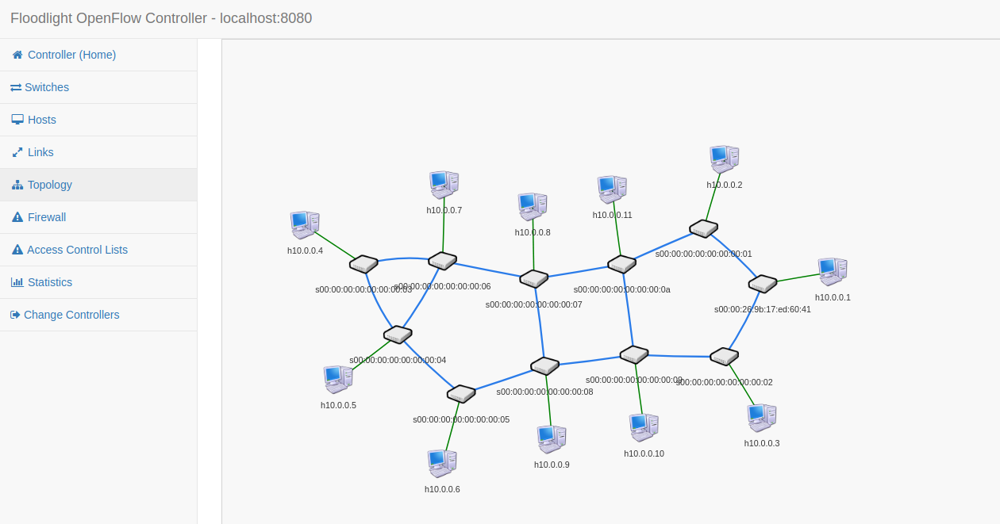

# topologyzoo_to_mininet
*Fastest way to run your [Topologyzoo topology](http://www.topology-zoo.org/dataset.html) on the [Mininet](http://mininet.org/)!*
 

## Prerequisites
- requests
- mininet

## How to use
- First you need to clone from the repository:
```
$ git clone https://github.com/hqasemi/topologyzoo_to_mininet.git
```
- Then cd into directory and make sure that the file is executable, then you can run it:
```
$ cd topologyzoo_to_mininet
$ chmod +x topologyzoo_to_mininet.py
$ ./topologyzoo_to_mininet.py <insert_arguments_here>
```
or you can simply run using python3 command:
```
$ python3 topologyzoo_to_mininet.py <insert_arguments_here>
```
**If it didn't work for you, it's required to run with python2!**
```
$ python2 topologyzoo_to_mininet.py <insert_arguments_here>
```

- You can use the following arguments:
```
arguments:
  -h, --help            show this help message and exit
  --availtopo           prints list of all available topologies and exit.
  --toponame TOPO_NAME  Topology name e.g. Abilene
  --cport CONTROLLER_PORT
                        Controller port in mininet, default value is 6653.
  --cip CONTROLLER_IP   Controller ip in mininet, default value is 127.0.0.1.
  --controller CONTROLLER_TYPE
                        Default controller is mininet controller, other
                        options: remote,ovscontroller
```


## Sample 1
You can see how many useful topologies you can have on mininet. Please consider using *--availtopo* switch to see all TopologyZoo topologies (http://www.topology-zoo.org/dataset.html):
```
# python3 topologyzoo_to_mininet.py --availtopo
Aarnet
Abilene
Abvt
Aconet
Agis
Ai3
Airtel
Amres
Ans
Arn
Arnes
Arpanet196912
Arpanet19706
Arpanet19719
Arpanet19723
Arpanet19728
AsnetAm
Atmnet
AttMpls
Azrena
Bandcon
Basnet
Bbnplanet
Bellcanada
Bellsouth
Belnet2003
...
```

## Sample 2
If you found the toponame by running sample1, then you can use the following command to connect that topology to a *remote* controller:
```
# ./topologyzoo_to_mininet.py --toponame Abilene --controller remote --cip 127.0.0.1 --cport 6653
*** Adding controller
*** Add switches
*** Add hosts
*** Add links
*** Starting network
*** Configuring hosts
h1 h2 h3 h4 h5 h6 h7 h8 h9 h10 h11 
*** Starting controllers
*** Starting switches
*** Post configure switches and hosts
*** Starting CLI:
mininet> nodes
available nodes are: 
c0 h1 h10 h11 h2 h3 h4 h5 h6 h7 h8 h9 s1 s10 s11 s2 s3 s4 s5 s6 s7 s8 s9
mininet> 
```
The following image demonstrates Floodlight controller's GUI after running [Abilene topology](http://www.topology-zoo.org/dataset.html)


## Todo
- multicontroller support
- choosing openflow version

## Any question, bug report or features request?
Don't hesistate to contact me: s.hesam.ghasemi@gmail.com
